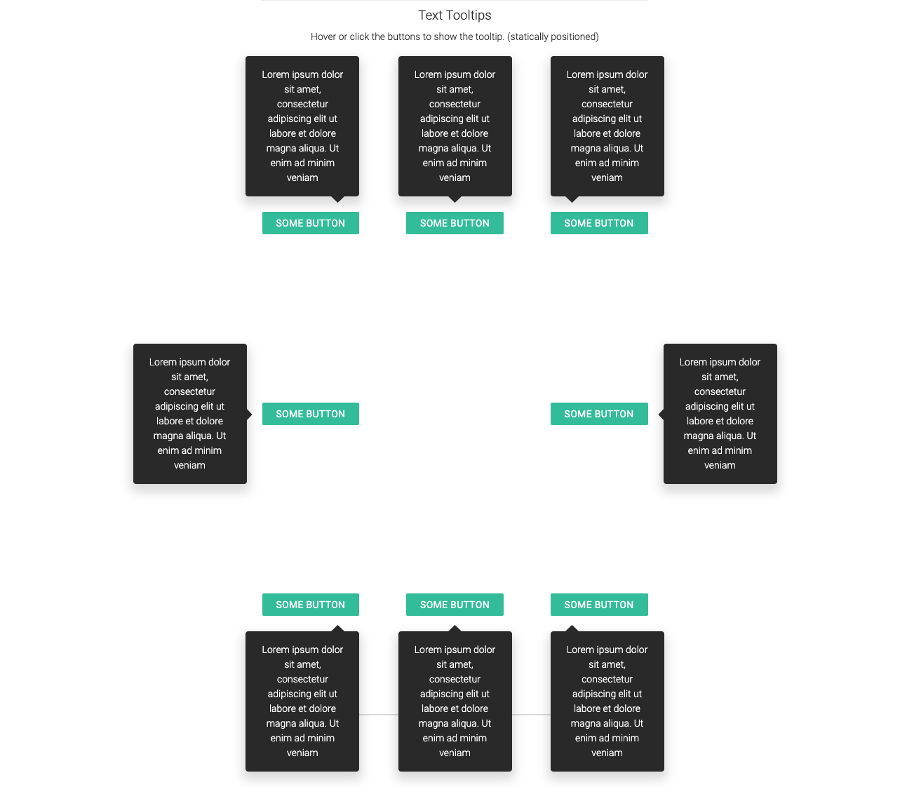

# React Tooltips

A personal project featuring tooltips built with React.

To run:
- Clone the repo
- cd into the project
- Run "yarn install"
- Run "yarn start"

## There are different types of tooltips and tooltip positions
*Note: These screenshots show statically positioned tooltips for demo purposes. The tooltips can also position themselves dynamically based on available space. You can see this in action by running the project and dragging the draggable tooltip buttons around the page.*

